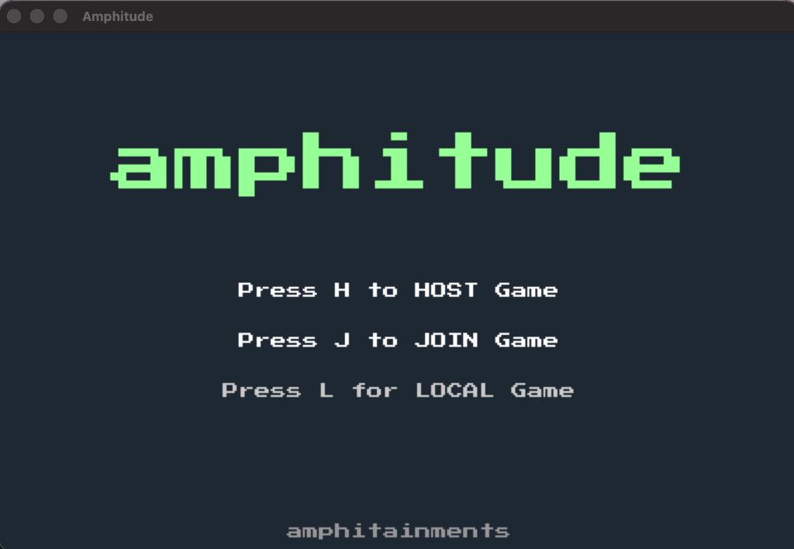
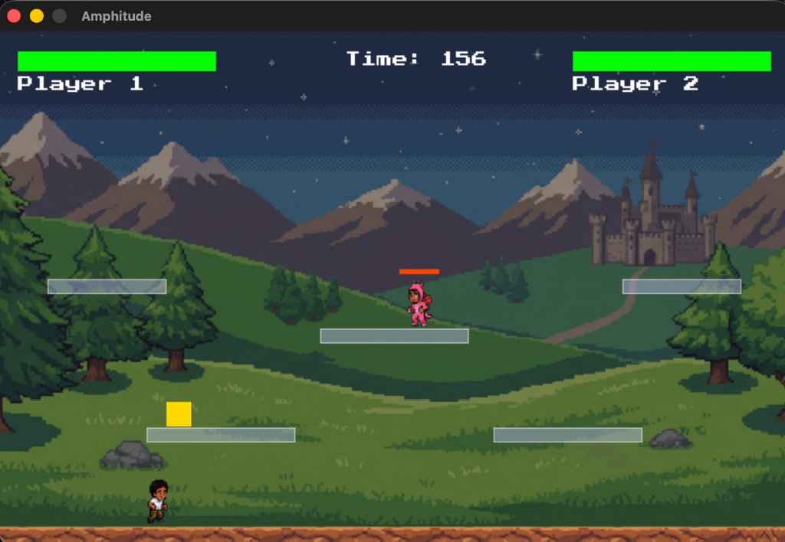
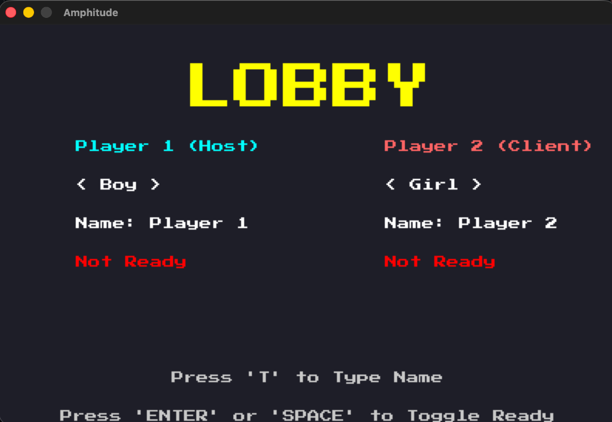
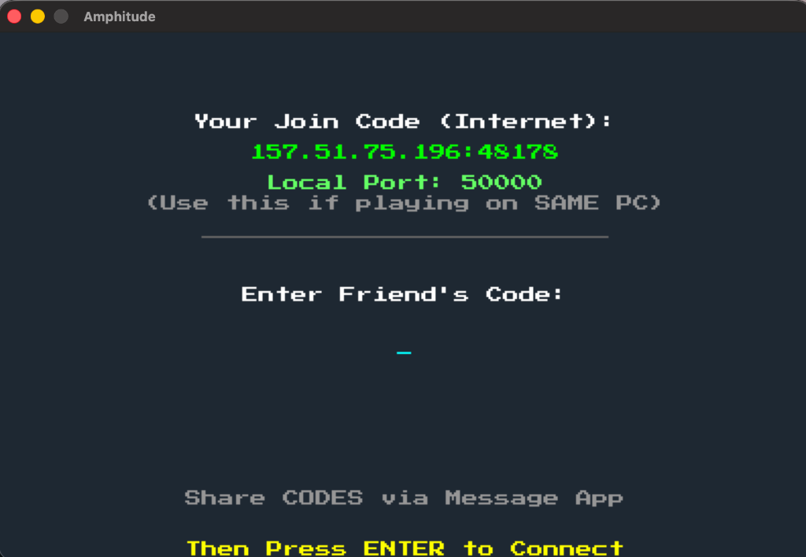

# amphitude

<div align="center">


**A high-octane, serverless multiplayer platform fighter built from scratch with C++ and SDL2.**

[Features](#-features) • [Installation](#-building--installation) • [How to Play](#-how-to-play) • [Architecture](#-technical-architecture) • [Docker](#-docker-support)

</div>

---

## 📖 Overview

**amphitude** removes the need for central servers by implementing a custom reliable UDP protocol with **NAT Hole Punching (STUN)**. This allows players to connect directly Peer-to-Peer (P2P) across the internet with zero latency overhead from intermediate relays.

Combined with a custom physics engine and pixel-perfect rendering, it offers a raw, competitive arcade experience reminiscent of classic fighters.

## 📸 Gallery

<p align="center">
  
  
</p>
<p align="center">
  
  
</p>

## ✨ Features

*   **⚔️ True Serverless P2P**: Direct client-to-client connection via UDP Hole Punching. Zero backend infrastructure required.
*   **⚡ Custom Engine**: Built purely on **SDL2**. No heavy game engines, just optimized C++.
*   **🥊 Combat System**: High-velocity combat with double jumps, wall mechanics, and projectile interactions.
*   **🕸️ Cross-Platform**: Native support for **macOS** (Silicon/Intel) and **Linux**.
*   **🛠️ Robust Networking**: Custom packet acknowledgement, state synchronization, and clock drift compensation.

---

## � Download & Installers

For easier distribution, you can generate standalone installers (no compiling required for end-users):

### 🍎 macOS (DMG)
1.  Run the generator script:
    ```bash
    ./packaging/create_mac_bundle.sh
    ```
2.  Open the file in `amphitude_releases/Amphitude_Installer_Mac.dmg`.
3.  Drag **amphitude** to your Applications folder.

### 🐧 Linux (Tarball)
1.  Run the generator script:
    ```bash
    ./packaging/create_linux_bundle.sh
    ```
2.  Extract `amphitude_releases/Amphitude_Linux.tar.gz`.
3.  Run `./run.sh` to launch the game.

---

## �🛠 Building & Installation

### Prerequisites

Ensure you have the **SDL2** development libraries installed on your system.

**macOS (Homebrew)**
```bash
brew install sdl2 sdl2_image sdl2_ttf sdl2_net
```

**Linux (Debian/Ubuntu)**
```bash
sudo apt update
sudo apt install build-essential libsdl2-dev libsdl2-image-dev libsdl2-ttf-dev libsdl2-net-dev
```

**Linux (Arch)**
```bash
sudo pacman -S base-devel sdl2 sdl2_image sdl2_ttf sdl2_net
```

**Windows (MSYS2) - Recommended**
1.  Install [MSYS2](https://www.msys2.org/).
2.  Open `MSYS2 UCRT64` terminal.
3.  Install Dependencies:
    ```bash
    pacman -S mingw-w64-ucrt-x86_64-gcc mingw-w64-ucrt-x86_64-sdl2 mingw-w64-ucrt-x86_64-sdl2_image mingw-w64-ucrt-x86_64-sdl2_ttf mingw-w64-ucrt-x86_64-sdl2_net
    ```
4.  Run `./build.sh`

**Windows (CMD/MinGW)**
1.  Install MinGW-w64 (e.g. via w64devkit).
2.  Ensure `g++` is in your PATH.
3.  Double-click `build.bat` (assuming libraries are setup).

### Compile from Source

We provide a universal build script that detects your OS and links the appropriate libraries.

```bash
# 1. Clone the repository
git clone https://github.com/PandiaJason/amphitude.git
cd amphitude

# 2. Build the executable
./build.sh
```

---

## 🎮 How to Play

### 1. Launching the Game
Run the game executable from your terminal:
```bash
./amphitude
```

### 2. Networking Modes

#### 🏠 Local Play (Same PC)
*   **Player 1** starts the game.
*   **Player 2** joins on the same keyboard (Controls below).
*   Select **"Local"** in the menu (Press `L`).

#### 🌍 Online Play (P2P)
amphitude uses a unique **"Join Code"** system to bypass firewalls.

1.  **HOST**: Press `H`. The game will generate a **Public Join Code** (e.g., `157.x.x.x:50000`).
2.  **SHARE**: Send this code to your friend via a messaging app.
3.  **JOIN**: Your friend presses `J` and sends you *their* code.
4.  **CONNECT**: Both players enter the **Other Person's Code** and press `ENTER`.
5.  **FIGHT**: The game punches through the NAT and starts the session.

### 🕹 Controls & Shortcuts

| Action | Player 1 (Host) | Player 2 (Client/Local) |
| :--- | :--- | :--- |
| **Move** | `W`, `A`, `S`, `D` | `Arrow Keys` |
| **Jump** | `W` (Double Jump) | `Up Arrow` (Double Jump) |
| **Attack** | `F` | `Enter` |
| **Ready** | `Space` / `Enter` | `Space` / `Enter` |
| **Menu: Toggle Season** | `S` (Forest/Arctic) | - |
| **Menu: Local Mode** | `L` | - |

### 💥 Power-Ups & Mechanics

*   **🔥 Dragon Potion (Fire)**:
    *   **Ability**: Shoot Fireballs (`F`/`Enter`).
    *   **Flight**: Hold Jump to glide/hover. (Only available in Dragon form).
*   **🛡️ Rhino Potion (Shield)**:
    *   **Ability**: Dash Attack (`F`/`Enter`). Deals massive damage.
    *   **Passive**: Immune to the first hit (which breaks the shield).
*   **❤️ Health**: Restores HP.

**Win Conditions:**
1.  **KO**: Reduce opponent's HP to 0.
2.  **Time Out**: Player with higher HP wins when time expires.
3.  **Sudden Death**: If HP is equal at timeout, next hit wins (Draw).

---

## ❓ Troubleshooting

**macOS: "App cannot be opened because the developer cannot be verified"**
1.  Right-click the App -> Click **Open**.
2.  Click **Open** in the dialog box.
*(This bypasses Apple's Gatekeeper for non-App Store apps).*

**Linux: "Error loading shared libraries: libSDL2..."**
Ensure you have installed the dependencies listed in the [Prerequisites](#prerequisites) section.

---

## 🐳 Docker Support

For testing Linux compatibility or simulating network scenarios on macOS, you can run amphitude inside a Docker container.

**Prerequisites**:
*   Docker Desktop
*   **XQuartz** (for macOS GUI forwarding)

**Run the Linux Build:**
```bash
# This script builds the image and configures X11 forwarding automatically
./run_docker.sh
```

> **Note for Network Testing**:
> When running Mac vs Docker on the same machine, use the **manual localhost mapping** to bypass router restrictions:
> *   **Mac Connects To**: `127.0.0.1:50001`
> *   **Docker Connects To**: `host.docker.internal:50000`

---

## ⚙️ Technical Architecture

### Networking Stack
*   **Transport**: UDP (User Datagram Protocol) for minimum latency.
*   **NAT Traversal**: Custom STUN implementation within `NetworkManager::discoverPublicIP()`.
*   **Protocol**:
    *   `OpCode 0 (PUNCH)`: NAT keep-alive and hole punching.
    *   `OpCode 1 (INPUT)`: Client input transmission.
4.  **
